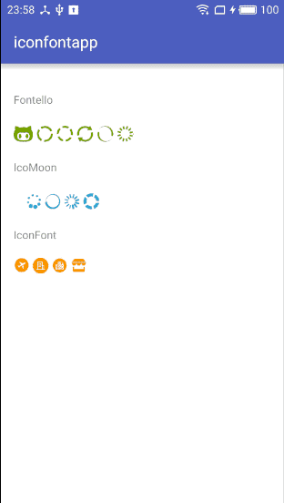

### IconFontApp

Demo application for using IconFont on Android platform.

[See the description of this implementation on my blog](http://hujiaweibujidao.github.io/blog/2016/06/25/Ways-to-Use-Icons-on-Android-2/)

### Core Code

```
Iconify.with(new FontelloModule());
Iconify.with(new IcomoonModule());

textViewFontello = (TextView) findViewById(R.id.textView_fontello);
textViewFontello.setText("{fe-github} {fe-spin1 spin} {fe-spin2 spin} {fe-spin3 spin} {fe-spin4 spin} {fe-spin5 spin}");

textViewIcoMoon = (TextView) findViewById(R.id.textView_icomoon);
textViewIcoMoon.setText("{im-spa} {im-spinner spin} {im-spinner2 spin} {im-spinner3 spin} {im-spinner4 spin}");

textViewIconFont = (TextView) findViewById(R.id.textView_iconfont);
textViewIconFont.setTypeface(Typeface.createFromAsset(getAssets(), "iconfont.ttf"));
//使用方式1：显示正确
textViewIconFont.setText("\ue601 \ue602 \uE603 \uE606");
//使用方式2：显示出错，没有显示出图标
textViewIconFont.setText("&#xe601; &#xe602; &#xe603; &#xe606;");
//使用方式3：显示正确
textViewIconFont.setText(R.string.text_iconfont_utf8);
//使用方式4：显示正确
textViewIconFont.setText(R.string.text_iconfont_unicode);
```

### Thanks

1.[Iconify](https://github.com/JoanZapata/android-iconify)     
2.[Fontello](https://github.com/fontello/fontello)      
3.[IcoMoon](https://icomoon.io/app/)     
4.[IconFont](http://www.iconfont.cn/)       

### License

```
The MIT License (MIT)

Copyright (c) 2016 Hujiawei

Permission is hereby granted, free of charge, to any person obtaining a copy
of this software and associated documentation files (the "Software"), to deal
in the Software without restriction, including without limitation the rights
to use, copy, modify, merge, publish, distribute, sublicense, and/or sell
copies of the Software, and to permit persons to whom the Software is
furnished to do so, subject to the following conditions:

The above copyright notice and this permission notice shall be included in all
copies or substantial portions of the Software.

THE SOFTWARE IS PROVIDED "AS IS", WITHOUT WARRANTY OF ANY KIND, EXPRESS OR
IMPLIED, INCLUDING BUT NOT LIMITED TO THE WARRANTIES OF MERCHANTABILITY,
FITNESS FOR A PARTICULAR PURPOSE AND NONINFRINGEMENT. IN NO EVENT SHALL THE
AUTHORS OR COPYRIGHT HOLDERS BE LIABLE FOR ANY CLAIM, DAMAGES OR OTHER
LIABILITY, WHETHER IN AN ACTION OF CONTRACT, TORT OR OTHERWISE, ARISING FROM,
OUT OF OR IN CONNECTION WITH THE SOFTWARE OR THE USE OR OTHER DEALINGS IN THE
SOFTWARE.
```